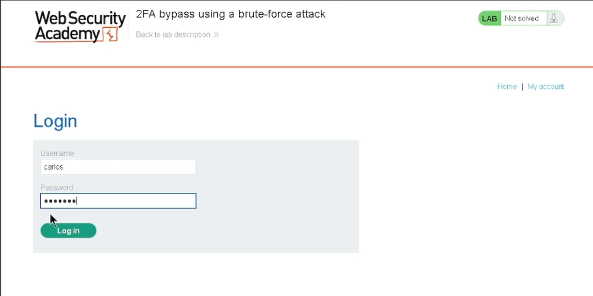
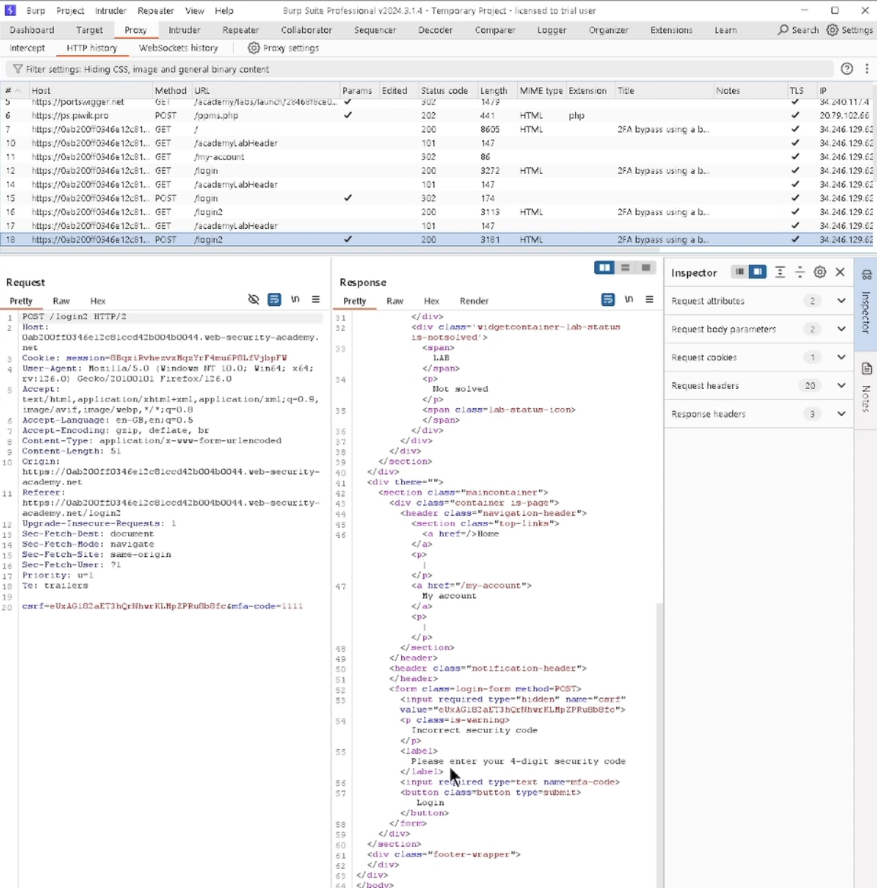
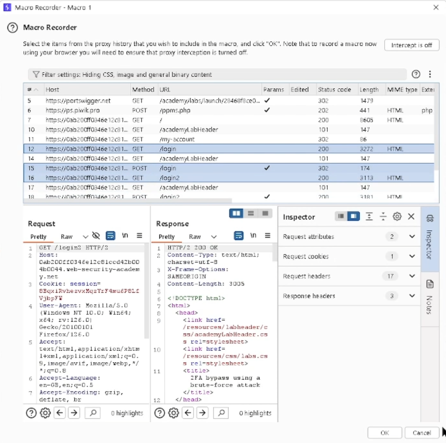

# Teaching 2FA security to beginners

A teaching presentation that explains how two-factor authentication (2FA) can fail, why it fails, and how to build it properly, aimed at people new to cybersecurity.

**Unit:** Ethical Hacking, second year, BSc (Hons) Computer Science, Manchester Metropolitan University. **Unit mark:** 75%.

**Tools:** PowerPoint, Burp Suite, a Linux practice environment, and a controlled web-security training lab.

## The brief

Pick one security vulnerability, study it hands on in a controlled lab, and build a resource that teaches it to a chosen audience. The work is marked on how well the resource explains the vulnerability, not on breaking anything live.

I chose brute-force weaknesses in 2FA systems, and I wrote the resource for newcomers to cybersecurity: students, people early in a job, and anyone who wants the basics without heavy jargon.

The hands-on work was done in PortSwigger's Web Security Academy, a free online platform of deliberately vulnerable labs built for practising security testing safely.

## What I produced

A structured presentation that takes a beginner from the idea to the fix:

| Part | What it covers |
|---|---|
| What 2FA is | Why a second factor is added on top of a password, and what it is meant to protect against |
| How the weakness arises | What goes wrong when a system accepts unlimited code attempts, or uses codes that are too simple |
| Why it matters | The real-world impact of an account takeover: data loss, financial and reputational harm |
| How to test for it safely | The ethical-testing workflow, carried out only in a provided training lab, never against a real service |
| How to fix it | Rate limiting, stronger codes, good session handling, and regular security reviews |

Every testing step in the resource was done inside a controlled lab built for exactly this purpose. The point of the resource is defensive: to show why these controls exist and what happens when they are missing.

## Decisions I made

**Chose one vulnerability and went deep.** The lab offered many vulnerabilities and that was overwhelming at first. Picking a single one, 2FA brute force, gave me a clear direction and a resource that explains one thing well rather than many things thinly.

**Wrote for the audience, not for myself.** Because the audience was beginners, I cut jargon, used a diagram on each slide, and kept each idea to one step. I checked each slide against the question "would someone new to this follow it?"

**Framed the whole thing around the fix.** The attack is only the setup. The resource spends its weight on causes and resolutions, so the lasting message is how to defend a system, not how to attack one.

**Learned a hard tool properly.** Burp Suite has a steep learning curve. I worked through it with tutorials, documentation and practice in the lab until I understood what each step was actually doing, rather than copying it blind.

Setting up a macro so the tool could re-authenticate on its own was the part that taught me the most about how the application handled sessions.

## What I would do differently

- **Lead with the defence.** I would open on how a well-built 2FA system behaves, then show the weakness as a contrast, so a beginner anchors on the secure design first.
- **Add a short checklist** a developer could run against their own 2FA: is there rate limiting, are codes long enough, what happens after repeated failures.
- **Cite the research more tightly.** I would tie each claim about impact to a named source on the slide itself.

## What I learned

- A good security resource is mostly about the defence. Understanding the weakness is the means; teaching people to prevent it is the point.
- Explaining something to a beginner is a real test of whether you understand it yourself.
- Hands-on practice in a safe, controlled environment is the honest way to learn security, and keeping it inside that environment is part of doing it ethically.

The full presentation and write-up are available on request.
