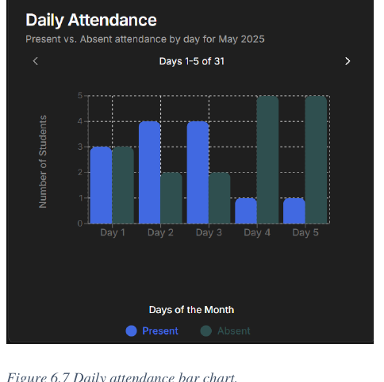
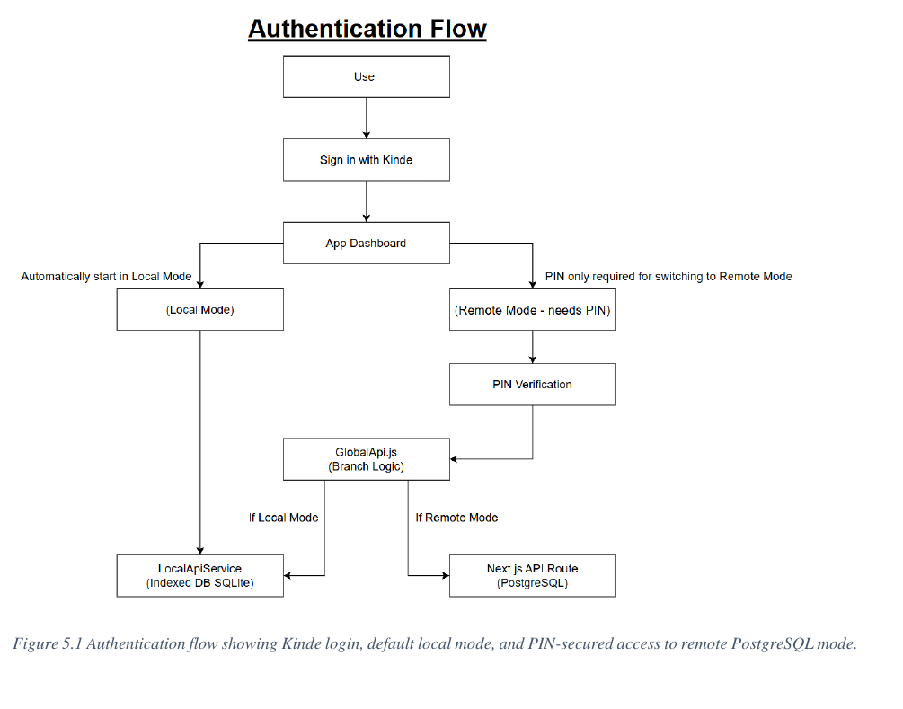
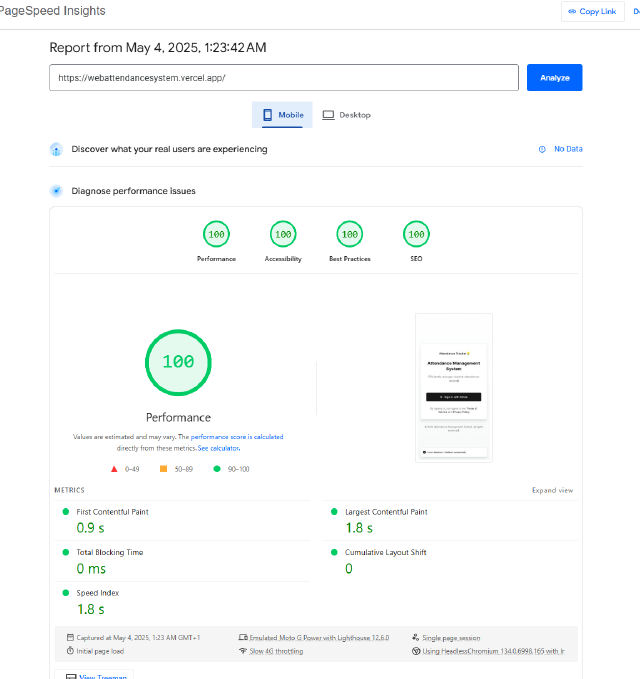

# Web-based attendance administration system

My final-year dissertation project: a full-stack web app that lets small community organisations, after-school clubs, church groups, youth charities, take attendance without paper registers, paid hosting or an IT team. It runs on a phone, works offline, and syncs to the cloud when needed.

**Live demo:** https://webattendancesystem.vercel.app

**Unit:** Synoptic Project (final-year dissertation), BSc (Hons) Computer Science, Manchester Metropolitan University. **Unit mark:** 62%.

**Built with:** Next.js, React, Tailwind, shadcn/ui, Recharts, AG Grid, Drizzle ORM, PostgreSQL (Neon), SQLite/IndexedDB, Kinde authentication, deployed on Vercel.

## The problem

Small organisations still track attendance on paper or in spreadsheets. It is slow, easy to get wrong, and gives no real picture of who is turning up. The paid tools that fix this assume a reliable internet connection, a budget and someone technical to run them, none of which a volunteer-run group can count on. I set out to build a free, secure, mobile-first alternative that a non-technical volunteer could actually use.

## What it does

- **Sign in with Google**, handled by a managed identity provider, so the app never stores passwords.
- **Add, edit and manage students** in an inline grid, with validation.
- **Mark attendance with one tap.** The badge flips instantly and rolls back if the server rejects it.
- **See the picture on a dashboard**: a daily bar chart and a monthly present/absent split.
- **Work offline.** The app runs entirely on the device when there is no connection, and can switch to a shared cloud database when there is.

## The part I am most proud of: one codebase, two databases

The same app runs against a local database on the device (IndexedDB) or a shared cloud database (PostgreSQL), with no change to the code. Both use one Drizzle schema, and every data operation goes through a single router that sends it to whichever store is active.

This means a scout group in a field with no Wi-Fi can use local mode and a city club can use shared cloud mode, from the identical app. Switching to the cloud is protected by a PIN, so a volunteer cannot put data online by accident.

## How it was built

I ran the project as six two-week agile sprints, with a working demo at the end of each. Requirements came from a survey of real stakeholders (students, administrators, volunteers), were prioritised with MoSCoW, and were traced through to test cases. The build had ethical approval from the university. Every push to GitHub triggered a Vercel build, and a change could not ship unless the tests and the performance budget passed.

## Results

I measured the finished system four ways:

- **Performance:** a perfect Google PageSpeed score of **100 / 100 / 100 / 100** (performance, accessibility, best practices, SEO) on mobile, with the page's main content painting in 1.8 seconds.
- **Functionality:** all **30** black-box test cases passed.
- **Security:** an OWASP ZAP scan found **no high or medium-risk issues** (one low-risk cookie flag on a third-party sign-in endpoint, outside my control).
- **Users:** 16 people tested it after release and rated it above **4.5 out of 5**, with navigation and clarity rated highest.

## What I would do differently

- **Finish real sync.** The offline-to-cloud sync has the full framework and UI, but the actual data merge is simulated. Real conflict handling when two devices edit offline is the main missing piece.
- **Add role-based access.** Right now any signed-in user can edit. Admin, teacher and viewer roles are the next step.
- **Test security by hand.** I only ran automated scans. A manual penetration test would catch logic flaws a scanner cannot.
- **Test with more users.** 16 testers is enough to show direction, not to prove it statistically.

## What I learned

- Building for people with no technical support changes every decision: defaults, error messages and "it must just work offline" matter more than features.
- One schema across two very different databases was the hardest and most rewarding design choice. Getting it right made everything downstream simpler.
- Honest evaluation is part of the engineering. Knowing exactly what my system does not yet do is as useful as knowing what it does.

The full dissertation and the source code are available on request.
