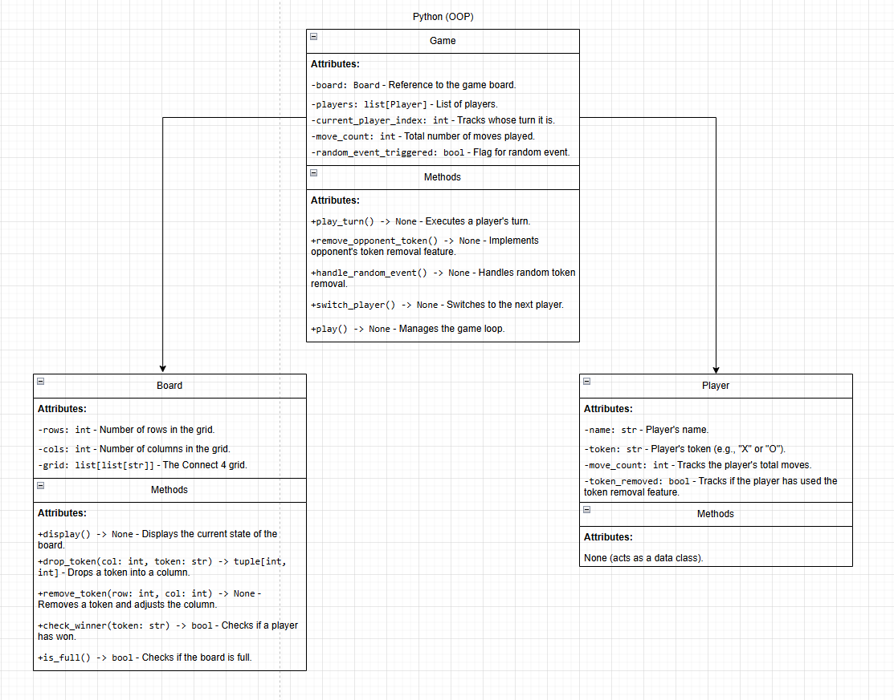
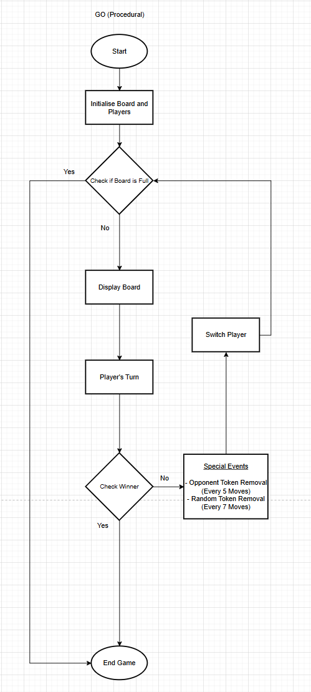
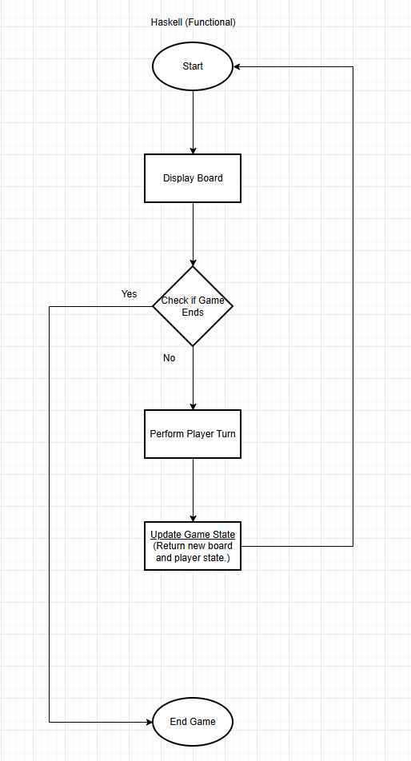

# Connect 4 in three programming paradigms

One game, Connect 4, built three times: in Python as object-oriented code, in Go as procedural code, and in Haskell as functional code. The point was to solve the same problem three ways and show what each paradigm is good at.

**Unit:** Programming Languages and Paradigms, final year, BSc (Hons) Computer Science, Manchester Metropolitan University. **Unit mark:** 68%.

**Languages:** Python, Go, Haskell. About 570 lines of code in total, plus a design document covering each version.

## The brief

Propose my own task and solve it in three different languages, each from a different paradigm, following how that paradigm is meant to be used. I chose Connect 4 and added two custom rules to make the logic harder:

- Every 5 moves, a player can remove one of the opponent's tokens.
- Every 7 moves, a token is removed from the board at random.

Both rules change the board mid-game, so each version has to rebuild or re-check its state carefully.

## The three versions

| Language | Paradigm | How it is built |
|---|---|---|
| Python | Object-oriented | Three classes: `Board` holds the grid, `Player` holds each player, `Game` runs the turns and the custom rules. State lives inside the objects. |
| Go | Procedural | A set of functions (`dropToken`, `checkWinner`, `removeToken`, `handleRandomEvent`) working over shared state, in a straight top-to-bottom flow. |
| Haskell | Functional | Pure functions and recursion. Nothing is changed in place: each move returns a brand-new board, and the game loop calls itself with that new state. |

### Python, object-oriented

The grid, the players and the game controller are separate objects, each responsible for its own part. This made the custom rules easy to slot in as methods on the `Game` class.

### Go, procedural

The same game as a sequence of steps: set up the board, take a turn, update the state, check for a win or a special event, and loop. State is shared and changed directly.

### Haskell, functional

No value is ever changed once it is made. Each turn produces a new board, and the game loop recurses with that new board rather than updating an old one. This is the biggest shift in thinking of the three.

## What the comparison showed

- **The same rule looks different in each paradigm.** Removing a token is a method call in Python, a function on shared state in Go, and a new board returned from a pure function in Haskell.
- **Object-oriented code organised the custom rules most cleanly**, because each rule had an obvious home on the `Game` class.
- **Procedural code was the most direct** to read top to bottom, but shared state made it easier to introduce a subtle bug.
- **Functional code was the hardest to start and the safest once working**, because immutability ruled out a whole class of state bugs.

## A bug worth keeping

In the Go version, my win check missed horizontal wins on the right-hand edge of the board. My first instinct was to stop the loop at `cols - 4`, picturing four tokens from the edge. That was wrong: the loop checks the *start* of a run of four, so the last valid start is `cols - 3`. Stopping one column early silently ignored a real win. I found it when a player got four in a row and the game did not call it. It is a good reminder that an off-by-one error can look completely reasonable until it costs someone the game.

## What I would do differently

- **Add automated tests**, not just manual checks and screenshots, so the win logic is proven the same way in all three languages.
- **Remove the shared global state in Go** by passing the board into each function, closer to how Go is written in practice.
- **Split the Haskell version into smaller pure functions** with type signatures on each, to make the recursion easier to follow.

## What I learned

- A paradigm is a way of thinking, not just a syntax. The hard part of the Haskell version was not the language, it was giving up the idea of changing things in place.
- Shared state is convenient and risky. The one real bug in the project lived in the version that used it most.
- Building the same thing three ways taught me more about each approach than building three different things would have.

The full design document and the code for all three versions are available on request.
