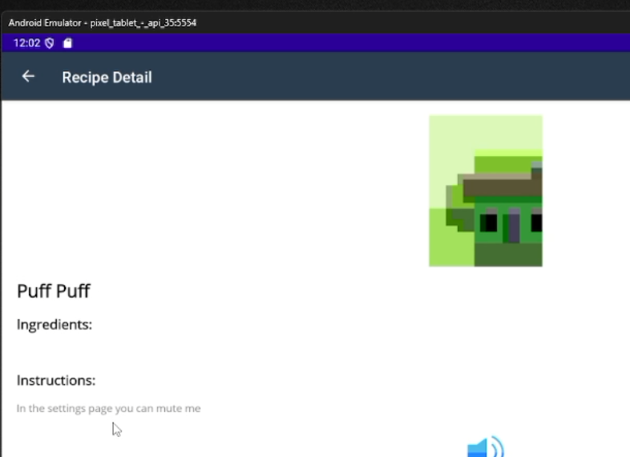
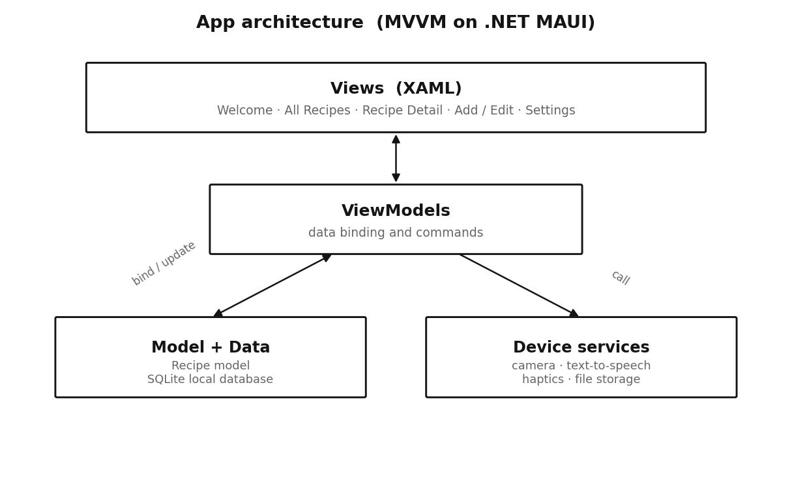
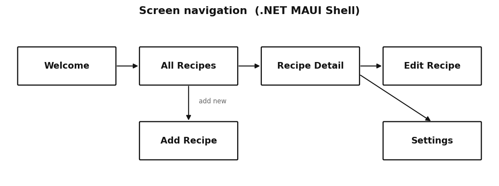

# Cross-platform recipe app (.NET MAUI)

A native mobile recipe app, "The PrepBook", built in C# with .NET MAUI. Users create, edit, search and view recipes, with photos, text-to-speech and offline storage on the device.

**Unit:** Mobile Computing, final year, BSc (Hons) Computer Science, Manchester Metropolitan University. **Unit mark:** 68%. Built as a small team project; the notes below focus on the areas I worked on.

**Built with:** C#, .NET 8 MAUI, XAML, SQLite, MVVM. One codebase targeting Android (tablet and phone), with iOS, Windows and macOS build targets.

## The brief

Design and build a cross-platform mobile app that makes good use of a phone's built-in device features, and deploy and test it on Android.

## What the app does

| Feature | What it does |
|---|---|
| Recipe management | Create, edit and delete recipes with title, description, ingredients, instructions and a photo |
| Photos | Add an image from the **device camera or gallery** |
| Search | Browse a searchable list of all saved recipes |
| Text-to-speech | The detail screen reads the instructions aloud |
| Settings | Toggle **dark / light mode**, text-to-speech and haptic feedback |
| Haptics | Vibration feedback on actions such as errors and delete confirmations |
| Offline storage | Everything is saved on the device, so it works with no internet |

## How it is built

The app follows the **MVVM pattern** (Model, View, ViewModel), so the screens and the logic stay separate and testable. Views are XAML, ViewModels hold the data binding and commands, and a small data layer handles the database.

- **SQLite for local storage.** A data layer runs create, read, update and delete against an on-device SQLite database, so recipes persist between sessions.
- **Dependency injection.** Services and pages are registered in `MauiProgram.cs` and injected where needed.
- **Shell navigation** with custom back-button behaviour to stop the back stack looping.
- **Device features** through .NET MAUI's APIs: camera and file storage, text-to-speech, vibration, and handling rotation and different screen sizes.

The screens are wired together with .NET MAUI Shell navigation:

## Technical overview

| Area | Choice |
|---|---|
| Framework | .NET 8 MAUI |
| Language | C# and XAML |
| Architecture | MVVM (Model-View-ViewModel) |
| Database | SQLite (local, offline) |
| Services | Dependency injection via `MauiProgram.cs` |
| Navigation | Shell navigation with custom back behaviour |
| Device APIs | Camera, file storage, text-to-speech, vibration |
| Targets | Android, iOS, Windows, macOS from one codebase |

## Testing

The app was tested and deployed on a physical Android phone and an Android tablet emulator. Camera capture, text-to-speech, vibration and rotation were all checked across different screen sizes and orientations.

## What I would do differently

- **Add automated tests.** The MVVM split makes the ViewModels testable; I would add unit tests around the data layer and commands.
- **Handle camera on emulators more gracefully**, with a clear fallback when no camera hardware is configured.
- **Improve image handling** so photos keep their aspect ratio rather than being cropped to fit.

## What I learned

- MVVM is worth the setup. Keeping the screens and the logic apart made the app far easier to reason about and change.
- One codebase, many platforms. .NET MAUI let the same C# build target Android, iOS, Windows and macOS, which changes how you plan layout and device features.
- Working in a team means agreeing structure early: shared navigation, naming and where logic lives, so everyone's screens fit together.

The source code is a private university coursework repository and is available to walk through on request.
