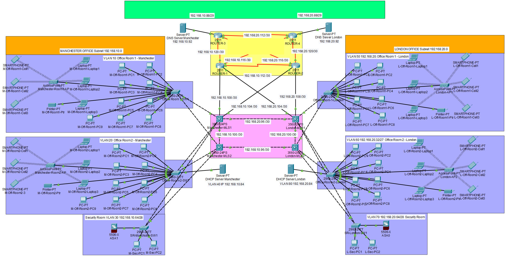

# Two-site network design

A network for a small start-up with offices in Manchester and London, designed, configured and tested in Cisco Packet Tracer.

**Unit:** Networks, second year, BSc (Hons) Computer Science, Manchester Metropolitan University. **Unit mark:** 78%.

## The brief

Design a secure, scalable network for a start-up with two sites. I aimed it at a software company with development teams in both cities, which needs the two offices to stay connected and their traffic kept apart.

My three objectives:

1. Use a CIDR addressing scheme that does not waste addresses.
2. Give administrators secure remote access with SSH.
3. Separate traffic with VLANs.

## What I built

| Area | What I did |
|---|---|
| Layout | Two offices, each with two office rooms and a security room, joined through a core of four routers and four multilayer switches |
| VLANs | VLANs 10, 20 and 30 in Manchester and 50, 60 and 70 in London, one per room, plus a server VLAN in each city |
| Addressing | A subnet plan sized to the number of devices in each room, with /30 links between routers and switches |
| Routing | OSPF between the sites, after testing RIP first |
| Services | A DHCP server and a DNS server in each city |
| Remote access | SSH version 2 on the routers, with encrypted passwords |
| Wireless | An access point in each office room for laptops and phones |
| Security rooms | A firewall and a separate VLAN in each city |

## Decisions I made

**Five versions of the design.** I started simple and improved it each time I found a weakness. The report shows all five.

**Newer routers.** I began with Cisco 2811 routers, then moved to 2911s for better performance, more memory and lower power use.

**Multilayer switches in the core.** Ordinary 2960 switches were enough inside each office. Between the cities I used 3560 multilayer switches, because they can route between VLANs themselves. That made the design simpler and needed less hardware.

**OSPF over RIP.** RIP was quick to set up and useful for early testing. I moved to OSPF because it finds a new route faster when a link fails and copes better as a network grows.

**Servers in both cities.** With DHCP and DNS in each office, one site keeps working if the link between them goes down.

**No single point of failure.** Every office switch connects to two core switches, and the core has more than one path between the cities.

## Testing

- Ping tests from Manchester to both London office rooms, and from London back.
- An SSH session from a Manchester office PC to a router.
- Checks that each device received the right address from its DHCP server.

## What I would do differently

- Add intrusion detection and tighter rules between VLANs.
- Write a disaster recovery plan.
- Keep device passwords out of the diagram. In the original I noted the lab passwords on the design itself. They are removed from the image here, and I would not do that on a real network.

## What I learned

Good network design is mostly about what happens when something breaks. Most of my five versions came from asking "what if this link fails?" and fixing the answer.

The full 41-page report is available on request.
