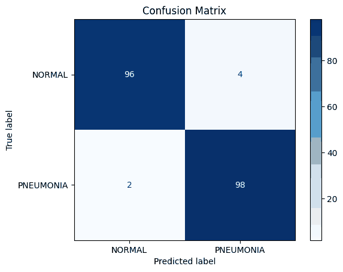
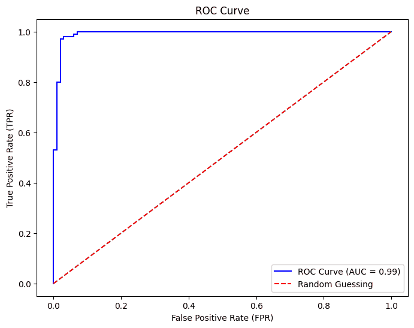
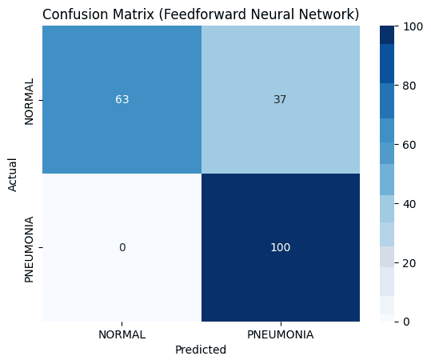

# Pneumonia classification with machine learning

Six machine learning models trained to detect pneumonia, first from patient records and then from chest X-ray images, with a research review of how far such models can be trusted in a hospital.

**Unit:** Artificial Intelligence, final year, BSc (Hons) Computer Science, Manchester Metropolitan University. **Unit mark:** 90%.

**Tools:** Python, pandas, scikit-learn, imbalanced-learn (SMOTE), TensorFlow and Keras, Matplotlib, Seaborn, Google Colab. A Jupyter notebook of 222 cells and about 1,000 lines of code.

## The brief

1. Build and compare classifiers that predict pneumonia from a table of patient measurements.
2. Test a colleague's claim that machine learning can classify raw X-ray images, raise performance and cut staff workload "with no downsides".
3. Build image classifiers to check that claim in practice.

## Part 1: patient records

**The data.** 584 patient records with 11 features, such as age, X-ray brightness and contrast, and the size of any consolidation.

**Cleaning.** I filled missing values, removed a duplicate, corrected mislabelled entries (for example "np" for "no pneumonia"), dropped the patient ID, handled outliers and balanced the two classes with SMOTE.

**Catching a data leak.** My first version scaled the whole dataset before splitting it into training and test sets. That lets information from the test set leak into training and makes results look better than they are. I moved the scaling inside cross-validation and kept the old code commented out to show the change.

**Models and results** on 333 test records:

| Model | Accuracy |
|---|---|
| Random Forest (tuned) | 80.5% |
| K-Nearest Neighbours | 71.8% |
| Decision Tree (tuned) | 70.9% |
| Gaussian Naive Bayes | 68.8% |
| Weighted soft-voting ensemble of all four | 76.0% |

Each model was tuned with a grid search and stratified k-fold cross-validation.

**What the ensemble showed.** Combining all four models scored lower than Random Forest alone, because the three weaker models pulled it down. The useful finding was different: where all four models agreed, they were right 87.4% of the time, and they disagreed on 47% of cases. Agreement between models is a signal of how far to trust a prediction.

## Part 2: research review

I reviewed published studies for and against the claim. The evidence supports the idea that models can classify X-rays accurately and save staff time. It does not support "no downsides". The main risks are bias in the training data, models that cannot explain their decisions, and performance that drops on data unlike what the model was trained on.

## Part 3: chest X-ray images

**The data.** 1,000 chest X-rays (500 normal, 500 pneumonia), converted to greyscale, resized to 64 by 64 pixels and split 800 for training and 200 for testing.

| Model | Accuracy | AUC |
|---|---|---|
| Random Forest (tuned: 150 trees) | 97.0% | 0.99 |
| Feedforward neural network (two hidden layers, dropout) | 81.5% | 1.00 |

**Reading the neural network result.** The network found every one of the 100 pneumonia cases but also flagged 37 healthy X-rays as pneumonia. Its AUC of 1.00 shows it separates the two classes well, so the weak accuracy comes from where the decision threshold sits, not from the model failing to learn. In a hospital, missing no cases at the cost of extra checks may even be the safer trade.

## What I would do differently

- **Balance after splitting, not before.** I applied SMOTE before the train and test split, so some synthetic records landed in the test set. That is the same kind of leak I fixed for scaling, and it means the Part 1 scores are a little optimistic.
- **Use a convolutional neural network.** A plain feedforward network ignores the layout of an image. A CNN, or a pre-trained model, is the standard for this task.
- **Tune the decision threshold** on the neural network.
- **Fix a reporting bug.** One comparison cell printed a model's ensemble weight in place of its accuracy.

## What I learned

- A high score is only as good as the test behind it. Most of my time went on making sure the evaluation was fair.
- More models is not always better. The ensemble lost to its best member.
- Accuracy alone can mislead. The neural network's confusion matrix told a very different story from its headline number.

The full notebook is available on request.
